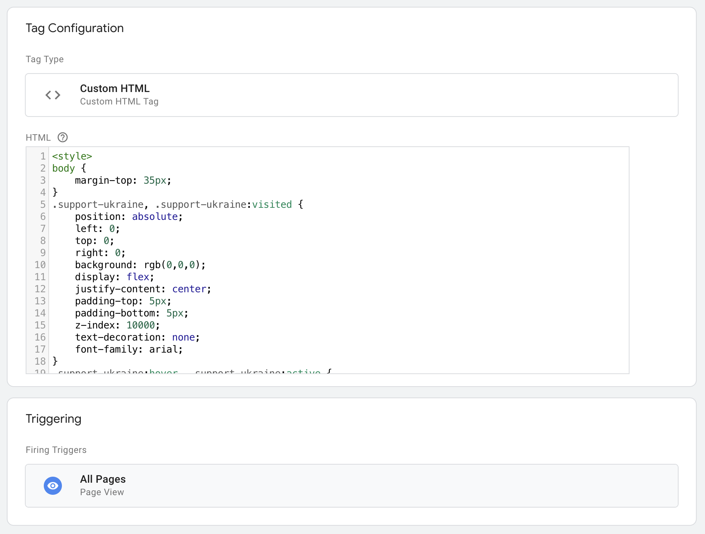

# Zero setup banner for websites to show support for Ukrainians

Use this snippet to show your support for Ukrainians on the top of your website. Installing it takes minutes.

1. [About](#about)
1. [Installation](#installation)
1. [Multilingual version](#multilingual-version)
1. [Reporting issues](#reporting-issues)

## About

This code adds a small black banner on top of your website with Ukrainian flag and support message. It links to Unicef's donation site but you can change the link to point to a support channel of your choice.

Even though the banner has been tested on multiple websites it has some issues for example on sites with sticky navigation.


## Installation

Installation is dead simple. Just copy this code to your template right after the opening `<body>` tag.

```
<style>
body {
	margin-top: 35px;
}
.support-ukraine, .support-ukraine:visited {
	position: absolute;
	left: 0;
	top: 0;
	right: 0;
	background: rgb(0,0,0);
	display: flex;
	justify-content: center;
	padding-top: 5px;
	padding-bottom: 5px;
	z-index: 10000;
	text-decoration: none;
	font-family: arial;
}
.support-ukraine:hover, .support-ukraine:active {
	background: black;
	display: flex;
	background: rgb(80,80,80);
	text-decoration: none;
}
.support-ukraine__flag {
	height: 25px;
	margin-right: 10px;
}
.support-ukraine__flag__blue {
	width: 40px;
	height: 12.5px;
	background: #005BBB;
}
.support-ukraine__flag__yellow {
	width: 40px;
	height: 12.5px;
	background: #FFD500;
}
.support-ukraine__label {
	color: white;
	font-size: 12px;
	line-height: 25px;
}
</style>
<a class="support-ukraine" href="https://help.unicef.org/ukraine-emergency" target="_blank" rel="nofollow noopener" title="Donate to support Ukraine's independence.">
	<div class="support-ukraine__flag" role="img" aria-label="Flag of Ukraine">
		<div class="support-ukraine__flag__blue"></div>
		<div class="support-ukraine__flag__yellow"></div>
	</div>
	<div class="support-ukraine__label">
		Donate to support Ukraine's independence.
	</div>
</a>
```

## Installation via Google Tag Manager

You can also easily install the banner with GTM.

1. Log into Tag Manager
1. Go to Tags view
1. Click New to add new tag
1. Set tag type to Custom HTML
1. Paste the snippet above to HTML field
1. Add All Pages trigger
1. Publish your changes



## Multilingual version

In case you want to add multiple language use this version. It checks document body for `lang` attribute and displays the label in website's language.

```
<style>
body {
	margin-top: 35px;
}
.support-ukraine, .support-ukraine:visited {
	position: absolute;
	left: 0;
	top: 0;
	right: 0;
	background: rgb(0,0,0);
	display: flex;
	justify-content: center;
	padding-top: 5px;
	padding-bottom: 5px;
	z-index: 10000;
	text-decoration: none;
  font-family: arial;
}
.support-ukraine:hover, .support-ukraine:active {
	background: black;
	display: flex;
	background: rgb(80,80,80);
	text-decoration: none;
}
.support-ukraine__flag {
	height: 25px;
	margin-right: 10px;
}
.support-ukraine__flag__blue {
	width: 40px;
	height: 12.5px;
	background: #005BBB;
}
.support-ukraine__flag__yellow {
	width: 40px;
	height: 12.5px;
	background: #FFD500;
}
.support-ukraine__label {
	color: white;
	font-size: 12px;
	line-height: 25px;
}

.support-ukraine__label--fi {
  display: none;
}

body[lang="en"] .support-ukraine__label--en {
  display: block;
}

body[lang="en"] .support-ukraine__label--fi {
  display: none;
}

body[lang="fi"] .support-ukraine__label--fi {
  display: block;
}

body[lang="fi"] .support-ukraine__label--en {
  display: none;
}
</style>
<a class="support-ukraine" href="https://help.unicef.org/ukraine-emergency" target="_blank" rel="nofollow noopener" title="Donate to support Ukraine's independence.">
	<div class="support-ukraine__flag" role="img" aria-label="Flag of Ukraine">
		<div class="support-ukraine__flag__blue"></div>
		<div class="support-ukraine__flag__yellow"></div>
	</div>
	<div class="support-ukraine__label support-ukraine__label--en">Donate to support Ukraine's independence.</div>
	<div class="support-ukraine__label support-ukraine__label--fi">Tue Ukrainan itsenäisyyttä lahjoittamalla.</div>
</a>
```

## Reporting issues

We are open for any feedback. Use GitHub [issue tracker](https://github.com/evermade/support-ukraine-banner/issues) to report issues.
